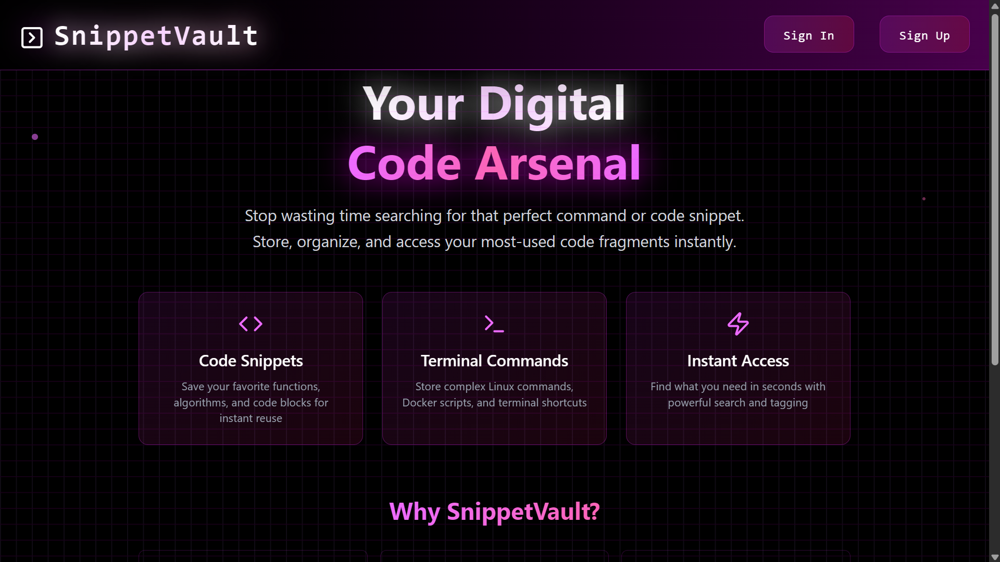
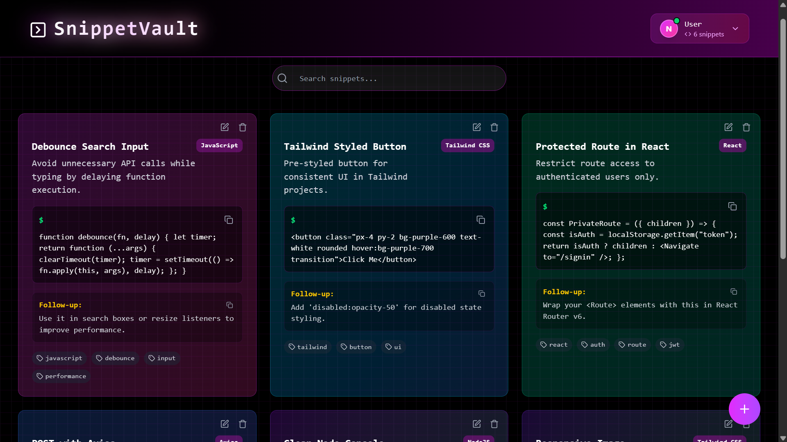
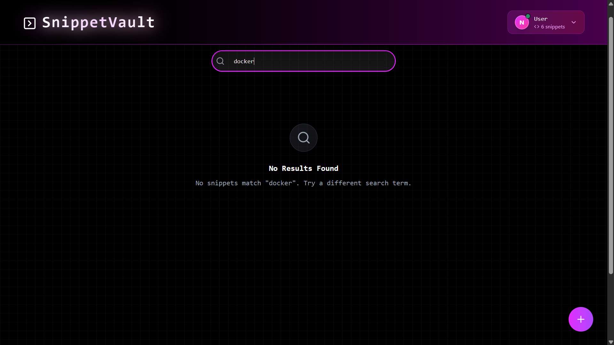
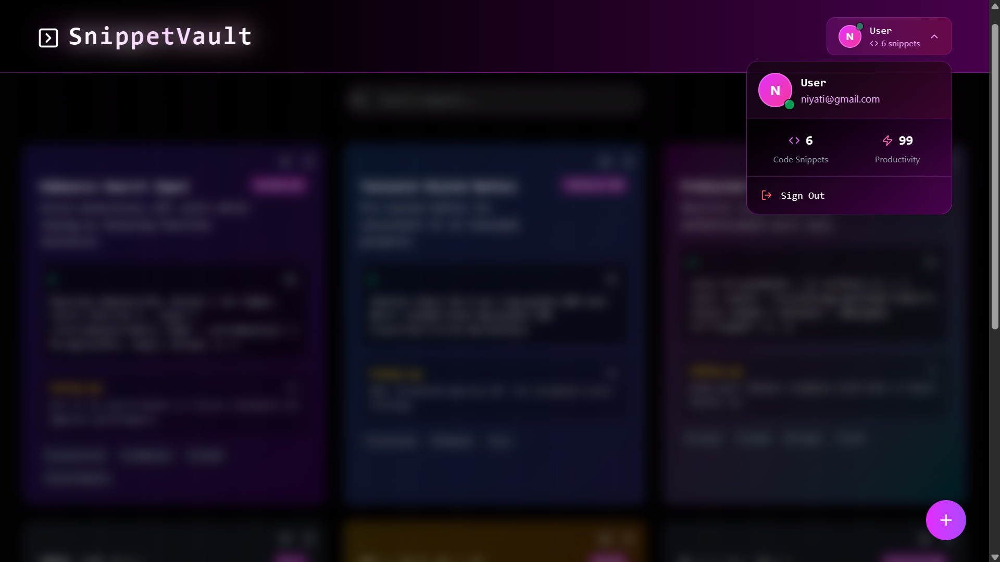

# 🔐 Snippet Vault (In Progress)

**Snippet Vault** is your personal, beautifully organized code snippet manager built with the **MERN Stack (MongoDB, Express, React, Node.js)**. Store, view, and copy your favorite code blocks anytime — syntax-safe, mobile-friendly.






---

## 🚀 Features

- 📁 Save code snippets with tags, categories, and descriptions
- 💾 Secure backend with JWT auth (optional)
- 📋 One-click copy to clipboard
- 🔎 Search & filter by category or tag (WIP)
- 🌓 Sleek dark-themed UI (built with Tailwind CSS)

---

## 🛠 Tech Stack

- **Frontend**: React + Tailwind CSS
- **Backend**: Node.js + Express.js
- **Database**: MongoDB + Mongoose
- **Auth**: JWT, bcrypt
- **Icons**: Lucide React

---

## 🧪 Running Locally

```bash
npm install
npm run both
```
